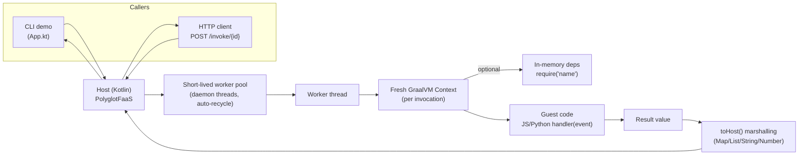

# GraalFaaS

[](https://github.com/geoffsee/GraalFaaS/actions/workflows/test.yml)
[](https://github.com/geoffsee/GraalFaaS/pkgs/container/graalfaas)

A minimal polyglot Function‑as‑a‑Service (FaaS) built on GraalVM's Polyglot API. It demonstrates how to embed GraalVM languages and execute user functions in an isolated context from a Kotlin host.

Supported guest languages:
- JavaScript (GraalJS)
- Python (GraalPython)

## Prelude
The GraalVM project stands as a remarkable gift and catalyst, enabling seamless interoperability among modern JVM languages like Kotlin and Scala while unlocking the power accumulated over 30 years of Java’s rich ecosystem. 
As Java marks three decades as a shared encoding of human problem-solving, Kotlin and Scala harness this legacy by targeting the JVM runtime, allowing developers to combine expressive modern language features with the mature robustness of Java’s libraries and tooling. 
This synergy not only elevates software development across diverse domains but also exemplifies how collaborative technological evolution transforms complex challenges into elegant solutions.

## Use cases
- PaaS (Platform-as-a-Service) primitive - Compose a complex system as a manifest of functions (not implemented, but should work)
- Allowing an AI system to execute code safely in isolation. (the inspiring use-case)
- Embedding user-defined functions in a Kotlin/JVM service without running a separate GraalVM distribution.
- On-prem or edge "serverless" style execution where functions are uploaded and invoked via HTTP.
- Safe(ish) execution of customer extensions, formulas, or webhooks with per-invocation timeouts and a fresh context per call.
- Data/ETL transformations using JavaScript or Python snippets executed close to the data path.
- Prototyping polyglot plugins for a larger application (JS/Python today; other engines can be added via Gradle).
- Educational reference for embedding GraalVM languages and marshaling values between guest and host.


## Quick start
Prerequisites:
- Internet access for Gradle to resolve dependencies from Maven Central.
- You do NOT need a local GraalVM installation. You also don't need a local JDK 21; Gradle Toolchains will provision it automatically.

## Limitations
- Storage exists as an in-memory construct, nothing is persisted.
- Networking is disabled in the isolates at runtime.

## Way Forward
Please understand, this was a random idea that happened to blossom. I track with Github issues in this repository as items present.
There are so many directions this could go. As such, I plan to keep the implementation as unopinionated as possible to 
ensure maximum compatibility with known use-cases.


### Run the demo
```bash
./gradlew run
```

You should see output like:
```
--- GraalFaaS Demo ---
JavaScript handler result: {message=Hello, World!}
```

The demo invokes the JavaScript function at `app/src/main/resources/functions/js/hello.js`:
```javascript
function handler(event) {
  return { message: `Hello, ${event.name}!` };
}
```

### Start the HTTP server
You can start the dev server in two ways:

- Development task (preferred for local use; override port with -Pport):
```bash
./gradlew dev -Pport=8080
```

- Using the existing run task:
```bash
./gradlew run --args="serve --port 8080"
```

### Run the JavaScript Agent (Bun)
This example uses @openai/agents to stream model output and demonstrate calling the GraalFaaS tool in a realistic workflow.

Prerequisites:
- Start the GraalFaaS dev server (see above). Defaults to http://localhost:8080
- Have Bun installed (https://bun.sh)
- An OpenAI API key in OPENAI_API_KEY (the agent uses @openai/agents)

Steps:
```bash
cd ai-examples/graaljs-agent
bun install
# point the agent at your server (optional if using the default)
export GRAALFAAS_URL=http://localhost:8080
# Option A: have the agent create and invoke a sample function (no env var needed)
#   → The agent will call graalfaas_create_function then graalfaas_invoke
bun dev

# Option B: point at an existing function ID so the agent only invokes
export GRAALFAAS_FUNCTION_ID=hello-js
bun dev
```

What to expect:
- With GRAALFAAS_FUNCTION_ID set, the demo instructs the model to call the graalfaas_invoke tool with an example event payload, then summarize the result and print the raw JSON from the tool.
- Without GRAALFAAS_FUNCTION_ID, the demo instructs the model to create a small sample function via graalfaas_create_function and then invoke it.

Notes:
- The tools use GRAALFAAS_URL if set, otherwise http://localhost:8080.
- Ensure your function ID exists on the server (if using Option B); otherwise the tool will return an error message that the agent will surface.
- The create tool uploads an inline JS handler that returns { message: "Hello, <name>!" } by default in the demo flow.

The server exposes:
- `GET /health` - health check endpoint
- `POST /invoke/{id}` - invoke a function by ID
- `POST /functions` - create/upload a function from a JSON manifest (see below)
- `GET /functions` - list uploaded functions

### Upload functions
Create a manifest file (JSON or JSONC):
```jsonc
// my-function.jsonc
{
  "id": "my-func",               // required: unique function ID
  "languageId": "js",            // required: "js" or "python"
  "functionName": "handler",     // optional: defaults to "handler"
  "jsEvalAsModule": false,       // optional: JS ES modules (default: false)
  "sourceFile": "my-function.js" // required: path to source file
                                 // OR use "source": "inline code here"
}
```

For functions with dependencies:
```jsonc
{
  "id": "my-func-with-deps",
  "languageId": "js",
  "sourceFile": "handler.js",
  "dependencies": {
    "greeter": { "file": "lib/greeter.js" },
    "utils": { "source": "module.exports = { add: (a,b) => a+b };" }
  }
}
```

Upload it:
```bash
./gradlew run --args="upload my-function.jsonc"
```

Functions are stored in `.faas/functions/{id}.json`

Create via HTTP (no CLI):
```bash
echo '{
  "id": "my-func",
  "languageId": "js",
  "functionName": "handler",
  "source": "function handler(event){ return { message: `Hello, ${'$'}{event.name}!` }; }"
}' | curl -sS -X POST http://localhost:8080/functions \
  -H "Content-Type: application/json" \
  -d @-
# List functions
curl -sS http://localhost:8080/functions | jq .
```

List uploaded functions:
```bash
./gradlew run --args="list"
```

Invoke via HTTP:
```bash
curl -X POST http://localhost:8080/invoke/my-func \
  -H "Content-Type: application/json" \
  -d '{"name": "World"}'
```

## Use Docker
```shell
docker run -p 8080:8080 ghcr.io/geoffsee/graalfaas:latest
```

The container automatically starts the HTTP server on port 8080.

To persist uploaded functions, mount a volume:
```shell
docker run -p 8080:8080 -v $(pwd)/.faas:/app/.faas ghcr.io/geoffsee/graalfaas:latest
```

## Deploy to GCP
> See `deployment` folder in this project


## Testing
- All tests: `./gradlew check` or `./gradlew :app:test`
- One test class: `./gradlew :app:test --tests "ltd.gsio.app.PolyglotFaasTest"`
- One test method: `./gradlew :app:test --tests "ltd.gsio.app.PolyglotFaasTest.javascript ES module handler returns greeting"`

Tip: Use println/System.out.println in tests for ad‑hoc debugging. Gradle is configured to show PASSED/FAILED/SKIPPED events.


## Using the FaaS from Kotlin
PolyglotFaaS constructs a fresh Graal Context per invocation and calls a named function with an event object.

Basic JavaScript example:
```kotlin
val jsSource = loadResource("/functions/js/hello.js")
val result = PolyglotFaaS.invoke(
    PolyglotFaaS.InvocationRequest(
        languageId = "js",
        sourceCode = jsSource,
        functionName = "handler",
        event = mapOf("name" to "World")
    )
)
// result is a Map: {message=Hello, World!}
```

Python example:
```python
# app/src/main/resources/functions/py/hello.py

def handler(event):
    name = event.get("name", "World")
    return f"Hello, {name}!"
```
```kotlin
val pySource = loadResource("/functions/py/hello.py")
val pyResult = PolyglotFaaS.invoke(
    PolyglotFaaS.InvocationRequest(
        languageId = "python",
        sourceCode = pySource,
        functionName = "handler",
        event = mapOf("name" to "PyUser")
    )
)
// pyResult is a String: "Hello, PyUser!"
```

Notes about Python:
- The host auto‑creates a Python trampoline `__faas_invoke__` so your `handler(event)` can be called without passing host objects into Python.
- Results are converted back to host types: primitives/strings; dicts→Map; lists→List; other objects→string fallback.


## JavaScript dependencies (CommonJS‑style in‑memory modules)
You can supply in‑memory module sources and `require(name)` them from your handler.

Dependency module (app/src/main/resources/functions/js/lib/greeter.js):
```javascript
module.exports = {
  greet: function(name) { return `Hello, ${name}!`; }
};
```

Handler using the dependency (app/src/main/resources/functions/js/hello-dep.js):
```javascript
const { greet } = require('greeter');
function handler(event) { return { message: greet(event.name) }; }
```

Host invocation:
```kotlin
val main = loadResource("/functions/js/hello-dep.js")
val dep = loadResource("/functions/js/lib/greeter.js")
val result = PolyglotFaaS.invoke(
    PolyglotFaaS.InvocationRequest(
        languageId = "js",
        sourceCode = main,
        event = mapOf("name" to "World"),
        dependencies = mapOf("greeter" to dep)
    )
)
```

Important:
- The loader only resolves modules from the provided in‑memory map; there is no filesystem or network access.
- Modules use a CommonJS shape: each module receives `(exports, module, require)` and should set `module.exports` or `exports`.


## JavaScript ES modules
You can evaluate your handler as an ES module. Export a named `handler(event)` and set `jsEvalAsModule = true`.

Example module (app/src/main/resources/functions/js/hello-esm.mjs):
```javascript
export function handler(event) {
  return { message: `Hello, ${event.name}!` };
}
```

Host invocation:
```kotlin
val jsSource = loadResource("/functions/js/hello-esm.mjs")
val result = PolyglotFaaS.invoke(
    PolyglotFaaS.InvocationRequest(
        languageId = "js",
        sourceCode = jsSource,
        jsEvalAsModule = true,
        event = mapOf("name" to "World")
    )
)
```

Notes:
- The module is evaluated with GraalJS module semantics; the module namespace is used to resolve the exported `handler`.
- In‑memory dependency support is currently CommonJS‑only via `require(name)`; `import` of other ES modules isn’t wired by this minimal loader.


## Project layout
- `app/` – FaaS host and examples
  - `src/main/kotlin/Faas.kt` – Polyglot invoker and marshalling logic
  - `src/main/kotlin/App.kt` – CLI demo entrypoint
  - `src/main/resources/functions/js/...` – JavaScript examples
  - `src/main/resources/functions/py/...` – Python examples
  - `src/test/kotlin/PolyglotFaasTest.kt` – polyglot unit tests
  - `src/test/kotlin/AppIntegrationTest.kt` – CLI demo integration test
- `utils/` – small utility module (not required by FaaS logic)


## Build basics and tooling
This is a Gradle multi‑project build. Key points:
- JDK 21 toolchain is enforced by the convention plugin (`buildSrc/src/main/kotlin/kotlin-jvm.gradle.kts → jvmToolchain(21)`).
- GraalVM engines come from Maven Central via the version catalog (`gradle/libs.versions.toml`):
  - org.graalvm.polyglot:polyglot
  - org.graalvm.js:js
  - org.graalvm.python:python
- The `:app` module depends on these via `implementation(libs.polyglot/js/python)`.

Common commands:
- `./gradlew run` – build and run the CLI demo
- `./gradlew build` – full build
- `./gradlew check` – run tests
- `./gradlew clean` – clean outputs

Reference: GraalVM embedding docs https://www.graalvm.org/latest/reference-manual/embed-languages


## Security model and isolation
GraalVM isolates are not OS processes; they are VM-level sandboxes that share the host process. A severe memory-corruption bug or a JNI/native escape in one isolate can compromise the entire process. Treat the current setup as a demo, not a hardened multi-tenant runtime.

### Execution model: worker pool and per-invocation timeouts
This project executes invocations on a short-lived worker pool and supports host-side timeouts per invocation.

- Worker pool
  - Implementation: a ThreadPoolExecutor with 0 core threads, max = CPU count, a SynchronousQueue, 30s keepAlive, daemon threads, and core thread timeout enabled.
  - Effect: threads are created on demand and recycled automatically when idle; there is no long-lived thread hoarding.
- Isolation per call
  - Each task still creates a fresh Graal polyglot Context; there is no context reuse. This preserves isolation characteristics of the previous design.
- Per-invocation timeout
  - API: InvocationRequest.timeoutMillis (null or <= 0 disables the timeout).
  - Behavior: the request is submitted to the pool and awaited with the specified timeout. On timeout, the task is cancelled via Future.cancel(true) and PolyglotFaaS.InvocationTimeoutException is thrown.

Example (Kotlin):
```kotlin
val jsSource = loadResource("/functions/js/hello.js")
val result = try {
    PolyglotFaaS.invoke(
        PolyglotFaaS.InvocationRequest(
            languageId = "js",
            sourceCode = jsSource,
            functionName = "handler",
            event = mapOf("name" to "World"),
            timeoutMillis = 5_000
        )
    )
} catch (e: PolyglotFaaS.InvocationTimeoutException) {
    // handle timeout
    mapOf("error" to e.message)
}
```

Notes:
- Timeouts are best-effort interruption; the guest engine typically honors interrupts, but code that ignores interruption may take a moment to unwind. The Context for that invocation is confined to the worker and is not reused.
- This is an in-process pool. For stronger isolation, use a process-based worker model as discussed in the Security section.

### CLI commands
The app supports multiple modes via command-line arguments:

```bash
# Run demo (no arguments)
./gradlew run

# Upload a function from a manifest file
./gradlew run --args="upload <manifest.jsonc>"

# Start HTTP server (default port 8080)
./gradlew run --args="serve"
./gradlew run --args="serve --port 9090"

# List all uploaded functions
./gradlew run --args="list"
```

### CLI demo and HTTP server defaults
- The CLI demo (App.kt) uses a default timeout of 5s when invoking the bundled JavaScript handler.
- The HTTP server endpoint POST /invoke/{id} also applies a 5s timeout per request.

Where to look in code:
- app/src/main/kotlin/Faas.kt → WorkerPool and invoke(...) implement the execution/timeout logic; doInvoke(...) contains the original context creation and function execution.
- app/src/main/kotlin/App.kt → passes timeoutMillis = 5_000 in the demo and server paths.


## Architecture at a glance
The diagram below shows the main parts and how a request flows through the system.



## What's next

If you just cloned the repo and ran the demo, here are a few next steps you can take right away:

- Run the CLI demo again to verify your environment:
  - ./gradlew run
- Start the HTTP server and invoke functions over HTTP:
  - ./gradlew run --args="serve --port 8080"
  - See: Start the HTTP server
- Upload your first function from a JSON/JSONC manifest:
  - Create a manifest (see: Upload functions)
  - ./gradlew run --args="upload my-function.jsonc"
  - List what’s stored: ./gradlew run --args="list"
- Try JavaScript flavors:
  - CommonJS-style in-memory dependencies via require(name) (see: JavaScript dependencies)
  - ES modules with jsEvalAsModule = true (see: JavaScript ES modules)
- Add or tweak a Python handler:
  - See app/src/main/resources/functions/py/hello.py
  - Run just the python test method:
    - ./gradlew :app:test --tests "ltd.gsio.app.PolyglotFaasTest.python hello handler returns greeting"
- Harden the sandbox for less-permissive execution:
  - See: Security model and isolation
  - Toggle allowAllAccess(false) and related options in app/src/main/kotlin/Faas.kt
- Run and iterate with tests:
  - All tests: ./gradlew check
  - One class: ./gradlew :app:test --tests "ltd.gsio.app.PolyglotFaasTest"
  - One method: ./gradlew :app:test --tests "ltd.gsio.app.PolyglotFaasTest.javascript ES module handler returns greeting"
- Run in Docker (no local JDK/GraalVM needed):
  - docker run -p 8080:8080 ghcr.io/geoffsee/graalfaas:latest
  - Persist uploads: -v $(pwd)/.faas:/app/.faas

## Troubleshooting
- Gradle can’t find a JDK: Let Gradle Toolchains download one (no local JDK 21 required). Ensure internet access on first run.
- Classpath/engine mismatch: Keep the GraalVM artifacts aligned via the single `graalvm` version in `gradle/libs.versions.toml`.
- Tests can’t find resources: Ensure paths start with `/functions/...` and use `getResourceAsStream` with UTF‑8 decoding as in the tests.

## Tips
- The Project layout section points to the key files if you want to jump straight into the host code (Faas.kt) or the sample functions.