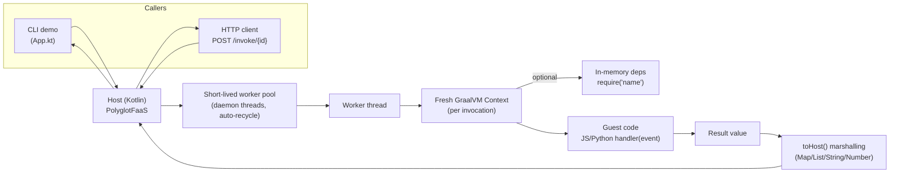

# GraalFaaS

```shell
no shame
```

A minimal polyglot Function‑as‑a‑Service (FaaS) built on GraalVM’s Polyglot API. It demonstrates how to embed GraalVM languages and execute user functions in an isolated context from a Kotlin host.

Supported guest languages:
- JavaScript (GraalJS)
- Python (GraalPython)


## Quick start
Prerequisites:
- Internet access for Gradle to resolve dependencies from Maven Central.
- You do NOT need a local GraalVM installation. You also don't need a local JDK 21; Gradle Toolchains will provision it automatically.

### Run the demo
```bash
./gradlew run
```

You should see output like:
```
--- GraalFaaS Demo ---
JavaScript handler result: {message=Hello, World!}
```

The demo invokes the JavaScript function at `app/src/main/resources/functions/js/hello.js`:
```javascript
function handler(event) {
  return { message: `Hello, ${event.name}!` };
}
```

### Start the HTTP server
```bash
./gradlew run --args="serve --port 8080"
```

The server exposes:
- `GET /health` - health check endpoint
- `POST /invoke/{id}` - invoke a function by ID

### Upload functions
Create a manifest file (JSON or JSONC):
```jsonc
// my-function.jsonc
{
  "id": "my-func",               // required: unique function ID
  "languageId": "js",            // required: "js" or "python"
  "functionName": "handler",     // optional: defaults to "handler"
  "jsEvalAsModule": false,       // optional: JS ES modules (default: false)
  "sourceFile": "my-function.js" // required: path to source file
                                 // OR use "source": "inline code here"
}
```

For functions with dependencies:
```jsonc
{
  "id": "my-func-with-deps",
  "languageId": "js",
  "sourceFile": "handler.js",
  "dependencies": {
    "greeter": { "file": "lib/greeter.js" },
    "utils": { "source": "module.exports = { add: (a,b) => a+b };" }
  }
}
```

Upload it:
```bash
./gradlew run --args="upload my-function.jsonc"
```

Functions are stored in `.faas/functions/{id}.json`

List uploaded functions:
```bash
./gradlew run --args="list"
```

Invoke via HTTP:
```bash
curl -X POST http://localhost:8080/invoke/my-func \
  -H "Content-Type: application/json" \
  -d '{"name": "World"}'
```

## Use Docker
```shell
docker run -p 8080:8080 ghcr.io/geoffsee/graalfaas:latest
```

The container automatically starts the HTTP server on port 8080.

To persist uploaded functions, mount a volume:
```shell
docker run -p 8080:8080 -v $(pwd)/.faas:/app/.faas ghcr.io/geoffsee/graalfaas:latest
```


## Testing
- All tests: `./gradlew check` or `./gradlew :app:test`
- One test class: `./gradlew :app:test --tests "ltd.gsio.app.PolyglotFaasTest"`
- One test method: `./gradlew :app:test --tests "ltd.gsio.app.PolyglotFaasTest.javascript ES module handler returns greeting"`

Tip: Use println/System.out.println in tests for ad‑hoc debugging. Gradle is configured to show PASSED/FAILED/SKIPPED events.


## Using the FaaS from Kotlin
PolyglotFaaS constructs a fresh Graal Context per invocation and calls a named function with an event object.

Basic JavaScript example:
```kotlin
val jsSource = loadResource("/functions/js/hello.js")
val result = PolyglotFaaS.invoke(
    PolyglotFaaS.InvocationRequest(
        languageId = "js",
        sourceCode = jsSource,
        functionName = "handler",
        event = mapOf("name" to "World")
    )
)
// result is a Map: {message=Hello, World!}
```

Python example:
```python
# app/src/main/resources/functions/py/hello.py

def handler(event):
    name = event.get("name", "World")
    return f"Hello, {name}!"
```
```kotlin
val pySource = loadResource("/functions/py/hello.py")
val pyResult = PolyglotFaaS.invoke(
    PolyglotFaaS.InvocationRequest(
        languageId = "python",
        sourceCode = pySource,
        functionName = "handler",
        event = mapOf("name" to "PyUser")
    )
)
// pyResult is a String: "Hello, PyUser!"
```

Notes about Python:
- The host auto‑creates a Python trampoline `__faas_invoke__` so your `handler(event)` can be called without passing host objects into Python.
- Results are converted back to host types: primitives/strings; dicts→Map; lists→List; other objects→string fallback.


## JavaScript dependencies (CommonJS‑style in‑memory modules)
You can supply in‑memory module sources and `require(name)` them from your handler.

Dependency module (app/src/main/resources/functions/js/lib/greeter.js):
```javascript
module.exports = {
  greet: function(name) { return `Hello, ${name}!`; }
};
```

Handler using the dependency (app/src/main/resources/functions/js/hello-dep.js):
```javascript
const { greet } = require('greeter');
function handler(event) { return { message: greet(event.name) }; }
```

Host invocation:
```kotlin
val main = loadResource("/functions/js/hello-dep.js")
val dep = loadResource("/functions/js/lib/greeter.js")
val result = PolyglotFaaS.invoke(
    PolyglotFaaS.InvocationRequest(
        languageId = "js",
        sourceCode = main,
        event = mapOf("name" to "World"),
        dependencies = mapOf("greeter" to dep)
    )
)
```

Important:
- The loader only resolves modules from the provided in‑memory map; there is no filesystem or network access.
- Modules use a CommonJS shape: each module receives `(exports, module, require)` and should set `module.exports` or `exports`.


## JavaScript ES modules
You can evaluate your handler as an ES module. Export a named `handler(event)` and set `jsEvalAsModule = true`.

Example module (app/src/main/resources/functions/js/hello-esm.mjs):
```javascript
export function handler(event) {
  return { message: `Hello, ${event.name}!` };
}
```

Host invocation:
```kotlin
val jsSource = loadResource("/functions/js/hello-esm.mjs")
val result = PolyglotFaaS.invoke(
    PolyglotFaaS.InvocationRequest(
        languageId = "js",
        sourceCode = jsSource,
        jsEvalAsModule = true,
        event = mapOf("name" to "World")
    )
)
```

Notes:
- The module is evaluated with GraalJS module semantics; the module namespace is used to resolve the exported `handler`.
- In‑memory dependency support is currently CommonJS‑only via `require(name)`; `import` of other ES modules isn’t wired by this minimal loader.


## Project layout
- `app/` – FaaS host and examples
  - `src/main/kotlin/Faas.kt` – Polyglot invoker and marshalling logic
  - `src/main/kotlin/App.kt` – CLI demo entrypoint
  - `src/main/resources/functions/js/...` – JavaScript examples
  - `src/main/resources/functions/py/...` – Python examples
  - `src/test/kotlin/PolyglotFaasTest.kt` – polyglot unit tests
  - `src/test/kotlin/AppIntegrationTest.kt` – CLI demo integration test
- `utils/` – small utility module (not required by FaaS logic)


## Build basics and tooling
This is a Gradle multi‑project build. Key points:
- JDK 21 toolchain is enforced by the convention plugin (`buildSrc/src/main/kotlin/kotlin-jvm.gradle.kts → jvmToolchain(21)`).
- GraalVM engines come from Maven Central via the version catalog (`gradle/libs.versions.toml`):
  - org.graalvm.polyglot:polyglot
  - org.graalvm.js:js
  - org.graalvm.python:python
- The `:app` module depends on these via `implementation(libs.polyglot/js/python)`.

Common commands:
- `./gradlew run` – build and run the CLI demo
- `./gradlew build` – full build
- `./gradlew check` – run tests
- `./gradlew clean` – clean outputs

Reference: GraalVM embedding docs https://www.graalvm.org/latest/reference-manual/embed-languages


## Security model and isolation
GraalVM isolates are not OS processes; they are VM-level sandboxes that share the host process. A severe memory-corruption bug or a JNI/native escape in one isolate can compromise the entire process. Treat the current setup as a demo, not a hardened multi-tenant runtime.

Where this repo sets the policy:
- app/src/main/kotlin/Faas.kt → Context.newBuilder(...).allowAllAccess(true) and the in-memory CommonJS `require` for JS.

Mitigation options, from lightest to strongest:

1) Harden in-process execution (low overhead)
- Turn off blanket access: prefer `allowAllAccess(false)`. Configure:
  - `allowHostAccess(HostAccess.NONE)`
  - `allowHostClassLookup { false }`
  - `allowNativeAccess(false)`
  - `allowCreateThread(false)` if handlers do not need to spawn threads
  - avoid exposing `polyglotBindings` and host objects
- Keep data-only boundaries: pass only primitive/Map/List data into the context; don’t pass live host objects.
- Remove the injected `require` unless you need it; if you keep it, resolve only from the provided in-memory map.
- Apply resource limits:
  - Use `org.graalvm.polyglot.ResourceLimits` to set a time/statement budget and cancel on overrun.
  - Impose host-side timeouts and cancel/close the context on timeout.
  - Bound JVM memory with `-Xmx`; note per-isolate memory caps are not available inside one process.
- Per-language tightening:
  - JavaScript: deny host access and class lookups; avoid exposing Java.* globals; prefer module code that doesn’t depend on host interop.
  - Python: keep the trampoline pattern used here and avoid exposing host objects or polyglot types directly.

2) Process/container isolation (strong)
- Run untrusted code in a separate worker process (a dedicated JVM or a native-image binary) and communicate via stdin/stdout, HTTP, or gRPC. Crash/restart isolates the blast radius.
- Use a short-lived worker pool with per-invocation timeouts and automatic recycling.
- Apply OS/container sandboxing:
  - Run as an unprivileged user inside a container or dedicated cgroup namespace.
  - Cap CPU/memory/pids with cgroups; set `no_new_privs`; mount read-only file systems; drop Linux capabilities; restrict network if not needed.
  - Enable seccomp/AppArmor/SELinux profiles.

3) MicroVM or syscall sandboxes (very strong)
- For high-assurance isolation, consider Firecracker/Kata/gVisor around the worker process. This adds overhead but provides a kernel or syscall boundary.

4) Operational hygiene
- Keep GraalVM engines up to date (single version pin in `gradle/libs.versions.toml`).
- Minimize the attack surface of the worker container/VM; centralize logging and enforce per-request quotas; aggressively recycle workers.

Minimal changes you can make in this repo for better defaults (still in-process):
- Change Faas.kt to build the context with reduced permissions, for example:
  // In PolyglotFaaS.invoke():
  Context.newBuilder(request.languageId)
      .allowAllAccess(false)
      .allowHostAccess(org.graalvm.polyglot.HostAccess.NONE)
      .allowHostClassLookup { false }
      .allowNativeAccess(false)
      .allowCreateThread(false)
      .option("engine.WarnInterpreterOnly", "false")
  ... // keep js.esm-eval-returns-exports when needed

Note: These settings make the demo safer but may break handlers that rely on host interop. For true multi-tenant isolation, prefer the separate-process model above.


## Troubleshooting
- Gradle can’t find a JDK: Let Gradle Toolchains download one (no local JDK 21 required). Ensure internet access on first run.
- Classpath/engine mismatch: Keep the GraalVM artifacts aligned via the single `graalvm` version in `gradle/libs.versions.toml`.
- Tests can’t find resources: Ensure paths start with `/functions/...` and use `getResourceAsStream` with UTF‑8 decoding as in the tests.


## Execution model: worker pool and per-invocation timeouts
This project executes invocations on a short-lived worker pool and supports host-side timeouts per invocation.

- Worker pool
  - Implementation: a ThreadPoolExecutor with 0 core threads, max = CPU count, a SynchronousQueue, 30s keepAlive, daemon threads, and core thread timeout enabled.
  - Effect: threads are created on demand and recycled automatically when idle; there is no long-lived thread hoarding.
- Isolation per call
  - Each task still creates a fresh Graal polyglot Context; there is no context reuse. This preserves isolation characteristics of the previous design.
- Per-invocation timeout
  - API: InvocationRequest.timeoutMillis (null or <= 0 disables the timeout).
  - Behavior: the request is submitted to the pool and awaited with the specified timeout. On timeout, the task is cancelled via Future.cancel(true) and PolyglotFaaS.InvocationTimeoutException is thrown.

Example (Kotlin):
```kotlin
val jsSource = loadResource("/functions/js/hello.js")
val result = try {
    PolyglotFaaS.invoke(
        PolyglotFaaS.InvocationRequest(
            languageId = "js",
            sourceCode = jsSource,
            functionName = "handler",
            event = mapOf("name" to "World"),
            timeoutMillis = 5_000
        )
    )
} catch (e: PolyglotFaaS.InvocationTimeoutException) {
    // handle timeout
    mapOf("error" to e.message)
}
```

Notes:
- Timeouts are best-effort interruption; the guest engine typically honors interrupts, but code that ignores interruption may take a moment to unwind. The Context for that invocation is confined to the worker and is not reused.
- This is an in-process pool. For stronger isolation, use a process-based worker model as discussed in the Security section.

### CLI commands
The app supports multiple modes via command-line arguments:

```bash
# Run demo (no arguments)
./gradlew run

# Upload a function from a manifest file
./gradlew run --args="upload <manifest.jsonc>"

# Start HTTP server (default port 8080)
./gradlew run --args="serve"
./gradlew run --args="serve --port 9090"

# List all uploaded functions
./gradlew run --args="list"
```

### CLI demo and HTTP server defaults
- The CLI demo (App.kt) uses a default timeout of 5s when invoking the bundled JavaScript handler.
- The HTTP server endpoint POST /invoke/{id} also applies a 5s timeout per request.

Where to look in code:
- app/src/main/kotlin/Faas.kt → WorkerPool and invoke(...) implement the execution/timeout logic; doInvoke(...) contains the original context creation and function execution.
- app/src/main/kotlin/App.kt → passes timeoutMillis = 5_000 in the demo and server paths.


## Architecture at a glance
The diagram below shows the main parts and how a request flows through the system.

